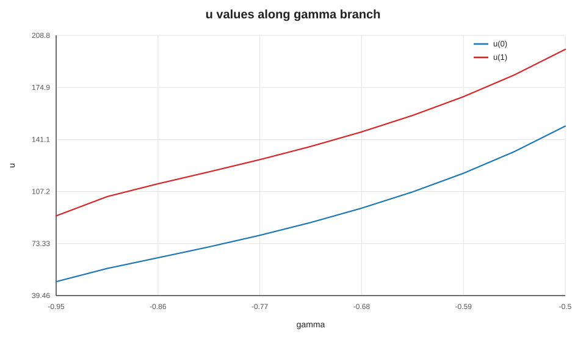
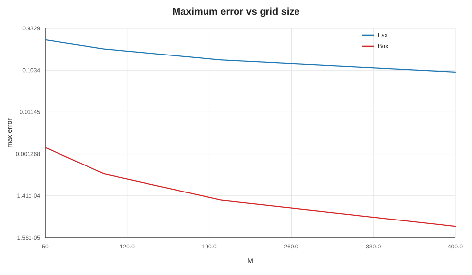
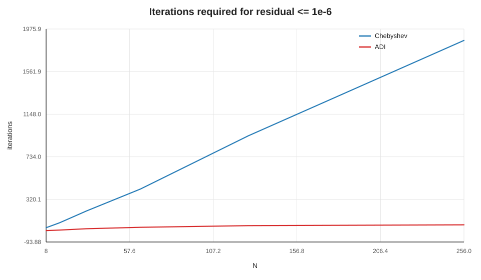

<div align="center">

# Computational Math

Практические работы по вычислительной математике: линейная алгебра, интерполяция, нелинейные уравнения, ОДУ, жесткие системы, гиперболические схемы и эллиптические задачи.


</div>

---

## Что это за репозиторий

Здесь собраны учебные реализации численных методов с расчетами, CSV-таблицами и SVG-визуализациями. Проект устроен по семестрам: `Sem5` содержит базовые численные методы, `Sem6` - более тяжелые задачи по дифференциальным уравнениям и разностным схемам.

Фокус репозитория - не только получить ответ, но и оставить воспроизводимый расчет: исходный код, параметры запуска, численные таблицы и графики лежат рядом с задачей.

## Галерея

<p align="center">
  
  
  
</p>

## Навигация

| Раздел | Тема | Что внутри |
|---|---|---|
| [`Sem5/Task1`](Sem5/Task1) | Численное дифференцирование | Односторонняя, центральная и высокоточная формулы; CSV с ошибками; генерация графиков. |
| [`Sem5/Task2`](Sem5/Task2) | Разложение Холецкого | Метод Банахевича, прямой/обратный ход, CMake-сборка и тесты. |
| [`Sem5/Task3`](Sem5/Task3) | Собственные значения | Метод вращений Якоби для симметричных матриц и проверка реконструкции. |
| [`Sem5/Task4`](Sem5/Task4) | Кубический сплайн | Натуральный сплайн и поиск максимальной скорости изменения температуры. |
| [`Sem5/Task5`](Sem5/Task5) | Метод Ньютона | Решение нелинейной системы двух уравнений через якобиан и правило остановки. |
| [`Sem5/Task6`](Sem5/Task6) | ОДУ | Жесткая линейная система и нелинейная задача двух тел с контролем инвариантов. |
| [`Sem6/Task1`](Sem6/Task1) | Жесткий Ван-дер-Поль | Неявные методы Рунге-Кутты, Ньютона на стадиях, adaptive step-doubling, функции устойчивости. |
| [`Sem6/Task2`](Sem6/Task2) | Нелинейная краевая задача | Метод пристрелки, вариационные уравнения, ветвь решений по параметру `gamma`, диагностика Ньютона. |
| [`Sem6/Task3`](Sem6/Task3) | Гиперболическая система | Характеристики, схемы Лакса и "уголок", разрывные граничные условия, порядки сходимости. |
| [`Sem6/Task4`](Sem6/Task4) | Уравнение Пуассона | Девятиточечный шаблон, чебышевские параметры, ADI/Писмен-Рэкфорд, сравнение итераций. |

## Быстрый старт

Требования минимальные: `gcc`, `g++`, `cmake` и `python3`. Для визуализаций дополнительные Python-пакеты не нужны: графики строятся напрямую в SVG.

```bash
git clone git@github.com:bulat1337/ComputationalMath.git
cd ComputationalMath
```

Проверить тестируемый модуль:

```bash
(cd Sem5/Task2 && ./do_all.sh)
```

Пересчитать задачи с готовыми визуализациями:

```bash
(cd Sem6/Task1 && gcc -O2 -std=c11 main.c -lm -o vdp_stiff_rk && ./vdp_stiff_rk && python3 plot.py)
(cd Sem6/Task2 && g++ -O2 -std=c++17 main.cpp -o task2 && ./task2 && python3 visualize.py)
(g++ -O2 -std=c++17 Sem6/Task3/main.cpp -o Sem6/Task3/task3 && ./Sem6/Task3/task3 && python3 Sem6/Task3/visualize.py)
(g++ -O2 -std=c++17 Sem6/Task4/main.cpp -o Sem6/Task4/task4 && ./Sem6/Task4/task4 && python3 Sem6/Task4/visualize.py)
```

## Структура проекта

```text
.
|-- Sem5/
|   |-- Task1/          # погрешности численного дифференцирования
|   |-- Task2/          # Cholesky + тесты
|   |-- Task3/          # метод Якоби
|   |-- Task4/          # кубический сплайн
|   |-- Task5/          # метод Ньютона
|   `-- Task6/          # жесткая линейная ОДУ и задача двух тел
`-- Sem6/
    |-- Task1/          # жесткая система Ван-дер-Поля
    |-- Task2/          # нелинейная краевая задача
    |-- Task3/          # линейная гиперболическая система
    `-- Task4/          # задача Дирихле для Пуассона
```

## Артефакты расчетов

| Путь | Содержание |
|---|---|
| [`Sem6/Task2/plots`](Sem6/Task2/plots) | Ветвь решений, невязки и профили `u`, `v`. |
| [`Sem6/Task3/results`](Sem6/Task3/results) | CSV с профилями, ошибками и оценками порядка сходимости. |
| [`Sem6/Task3/plots`](Sem6/Task3/plots) | Профили решения, графики ошибок и сходимости. |
| [`Sem6/Task4/results`](Sem6/Task4/results) | Таблица итераций, поверхности решения и профиль на сечении. |
| [`Sem6/Task4/plots`](Sem6/Task4/plots) | Сравнение методов, профиль возле разрыва данных и число итераций. |

## Стиль решений

Код написан как набор самостоятельных учебных экспериментов: каждая задача хранит свою постановку, параметры и способ запуска. В C/C++-части основной акцент сделан на явных реализациях алгоритмов без внешних численных библиотек, а Python используется как легкий слой для построения графиков и HTML-страниц.

---

<div align="center">

Репозиторий для быстрых экспериментов, проверки формул и аккуратного сравнения численных методов.

</div>
