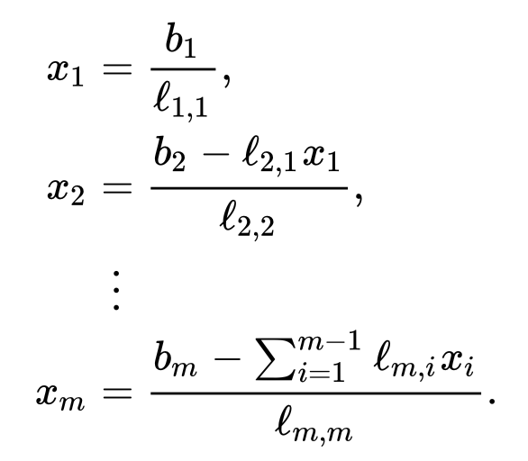

# Реализация метода Холецкого

## Алгоритм разложения:

## Алгоритм решенеия СЛАУ после разложения

### Решаем $Ly = b$ с помощью forward substitution для нижнетреугольной матрицы L

### Решаем $L^{*}x = y$ используя back substitution